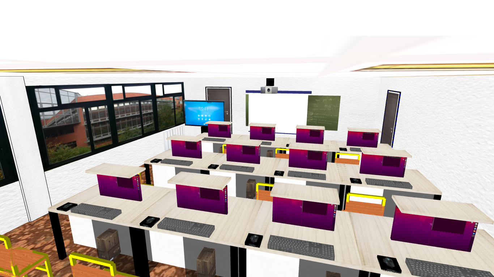
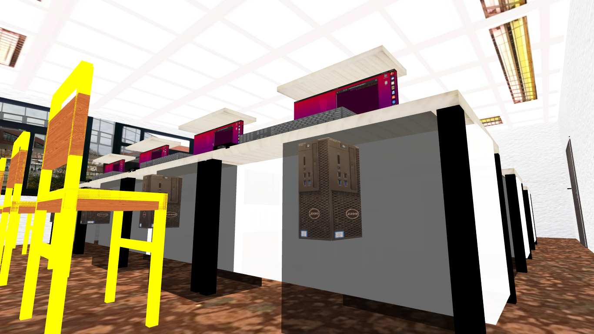
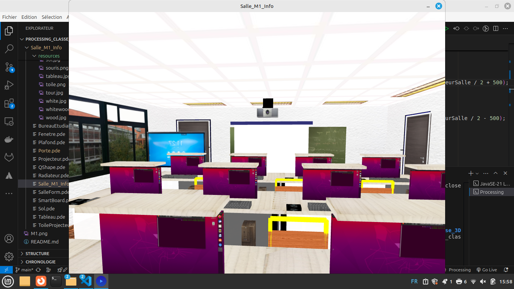

# processing_classe_3D

## **Description**
Ce projet consiste à créer une représentation en 3D d'une salle de classe informatique à l'aide de Processing, un environnement de programmation graphique.
L'objectif est de modéliser la salle M1 Informatique de l'Université du Havre en 3D avec processing, en intégrant des bureaux équipés d'écrans extractibles, des chaises, un tableau, un vidéoprojecteur, un plateau en bois, portes, fenêtres, plafond, sol, murs, etc
Le projet s'inscrit dans le cadre du Master Informatique M1 à l'Université du Havre et a pour but de développer des compétences en modélisation, visualisation et animation 3D, tout en explorant l'intégration de textures et de mouvements interactifs.

## **Fonctionnalités**

- Modélisation d'une salle de classe en 3D
- Création de bureaux équipés d'écrans extractibles
- Intégration de chaises, tableaux, vidéoprojecteur, plateau en bois, portes, fenêtres, plafond, sol, murs, etc
- Exploration de textures et de mouvements interactifs
- Visualisation et animation 3D

## **Technologies**
- Processing
- Java

## **Installation**
- Télécharger et installer Processing sur le site officiel : https://processing.org/download/

## **Aperçu**
- Voici un aperçu de la salle de classe informatique en 3D modélisée avec Processing :

 

## **
## **Auteurs**
- [THIAM PAPA](https://www.linkedin.com/in/papa-thiam-b914991b7/)