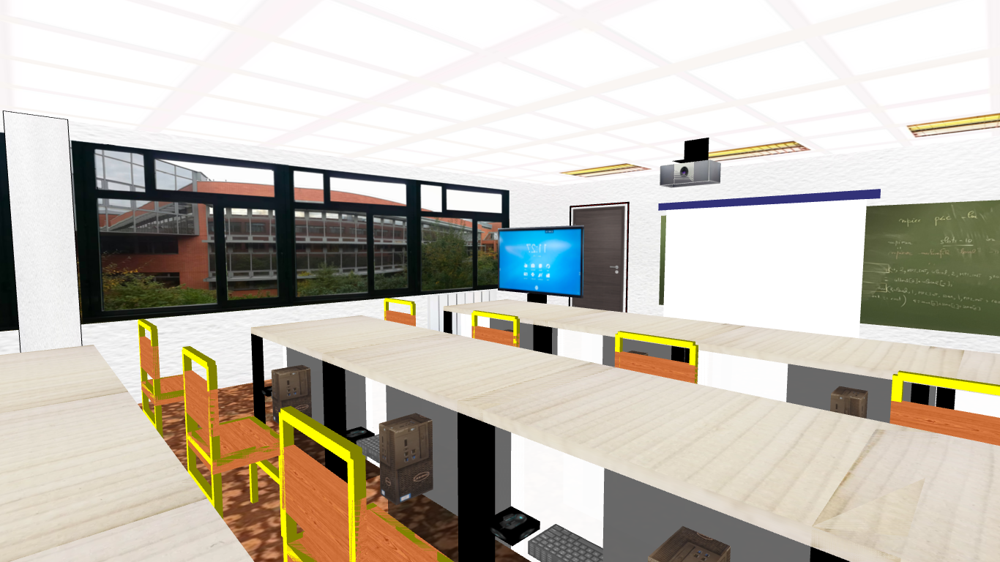
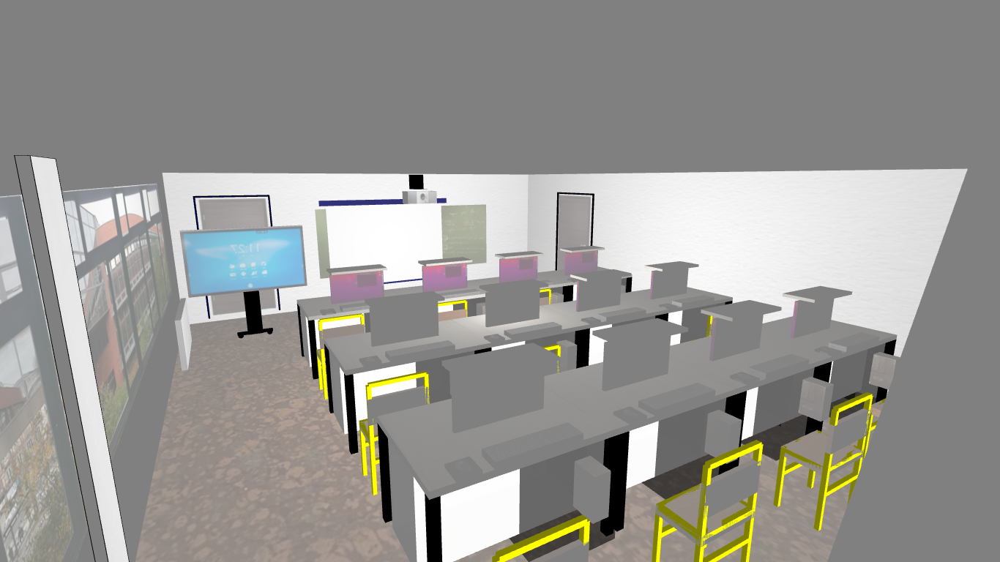

# processing_classe_3D

## **Description**
Ce projet consiste à créer une représentation en 3D d'une salle de classe informatique à l'aide de Processing, un environnement de programmation graphique.
L'objectif est de modéliser la salle M1 Informatique de l'Université du Havre en 3D avec processing, en intégrant des bureaux équipés d'écrans extractibles, des chaises, un tableau, un vidéoprojecteur, un plateau en bois, portes, fenêtres, plafond, sol, murs, etc
Le projet s'inscrit dans le cadre du Master Informatique M1 à l'Université du Havre et a pour but de développer des compétences en modélisation, visualisation et animation 3D, tout en explorant l'intégration de textures et de mouvements interactifs.

## **Fonctionnalités**

- Modélisation d'une salle de classe en 3D
- Création de bureaux équipés d'écrans extractibles
- Intégration de chaises, tableaux, vidéoprojecteur, plateau en bois, portes, fenêtres, plafond, sol, murs, etc
- Exploration de textures et de mouvements interactifs
- Visualisation et animation 3D

## **Technologies**
- Processing
- Java

## **Installation**
- Télécharger et installer Processing sur le site officiel : https://processing.org/download/

## **Aperçu**
- Voici un aperçu de la salle de classe informatique en 3D modélisée avec Processing :

- Vue de la salle de classe avec fermeture des bureaux:

 

- Avec exteinction des lumières:

---

## **Quelques fonctionnalités**
- **Rotation de la caméra** : vous pouvez faire pivoter la caméra autour de la salle de classe en utilisant la souris.
- **Zoom avant/arrière** : vous pouvez zoomer sur la salle de classe en utilisant la molette de la souris.
- **Ouverture/fermeture des portes** : vous pouvez ouvrir et fermer les portes de la salle de classe en appuyant sur la touche "O".
- **Allumage/extinction des lumières** : vous pouvez allumer et éteindre les lumières de la salle de classe en appuyant sur la touche "L".
- **Ouverture/fermeture des coffres ordinateurs** : vous pouvez ouvrir et fermer les coffres des ordinateurs en appuyant sur la touche "C".
- **Activation/désactivation du vidéoprojecteur** : vous pouvez activer et désactiver le vidéoprojecteur en appuyant sur la touche "P" qui affiche une image sur le tableau.
- **Allumage/extinction de la lumière de la salle** : Ici un shader est utilisé pour simuler l'allumage et l'extinction de la lumière de la salle. Vous pouvez activer et désactiver la lumière de la salle en appuyant sur la touche "L".

## **Auteurs**
- [THIAM PAPA](https://www.linkedin.com/in/papa-thiam-b914991b7/)

## **Statut du projet**
Le projet est terminé et fonctionnel. Néanmoins, des améliorations et des fonctionnalités supplémentaires peuvent être ajoutées.

## **License**
Ce projet est sous licence MIT - voir le fichier [LICENSE.md](LICENSE.md) pour plus d'informations.